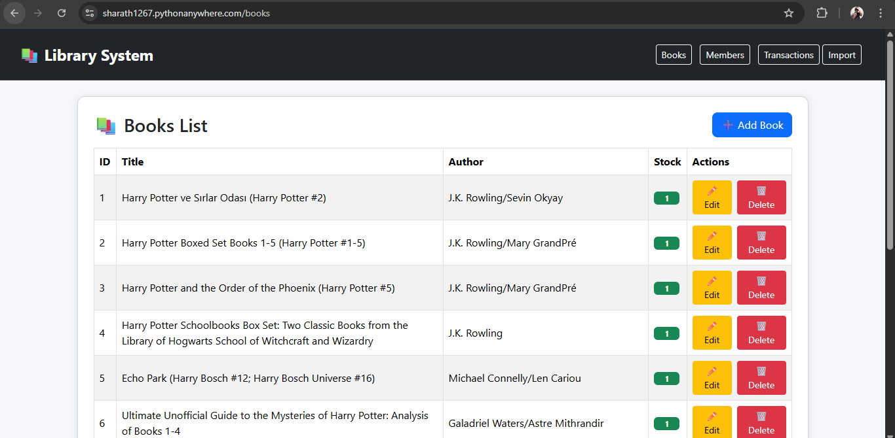
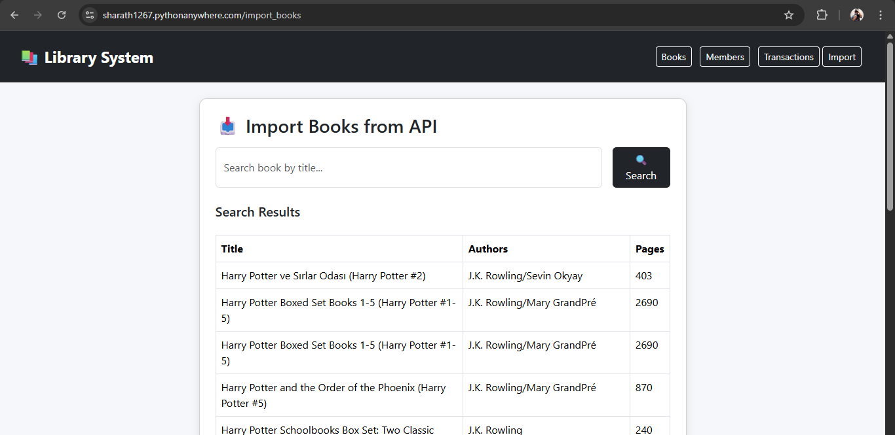
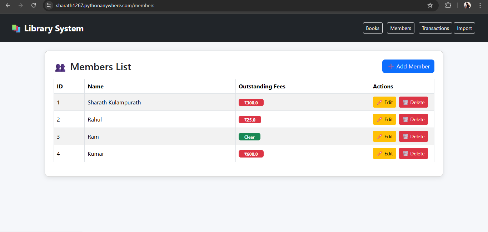
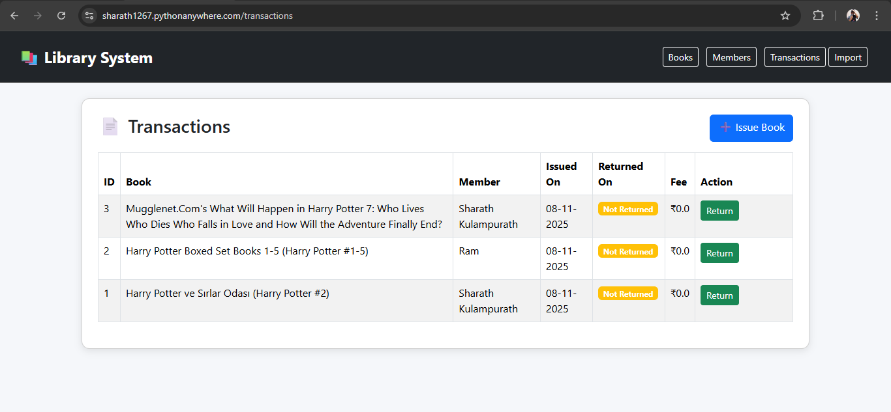

# Library Management System 📚

A web-based library management application built using **Flask**, **SQLite**, and **SQLAlchemy**.  
This app allows librarians to manage books, members, transactions, rent fees, and import books from the Frappe API.

---

## ✅ Features

### 🔹 Books Module
- Add, edit, delete books  
- Track stock  
- Search books  
- Import books from API (Frappe)

### 🔹 Members Module
- Add, edit, delete members  
- Track outstanding fees  
- Prevent issuing books if fees > ₹500

### 🔹 Transactions Module
- Issue books  
- Return books  
- Auto-calculate rent fees (₹10/day after 7 days)  
- Update book stock  

---

## ✅ Tech Stack

- Python / Flask  
- SQLite  
- SQLAlchemy ORM  
- HTML / Bootstrap  
- Requests library (for API)

---

## ✅ Screenshots

### 📌 Books List


### 📌 Add Book


### 📌 Import Books


### 📌 Members


### 📌 Transactions


---

## ✅ How to Run Locally

```bash
pip install -r requirements.txt
python app.py
